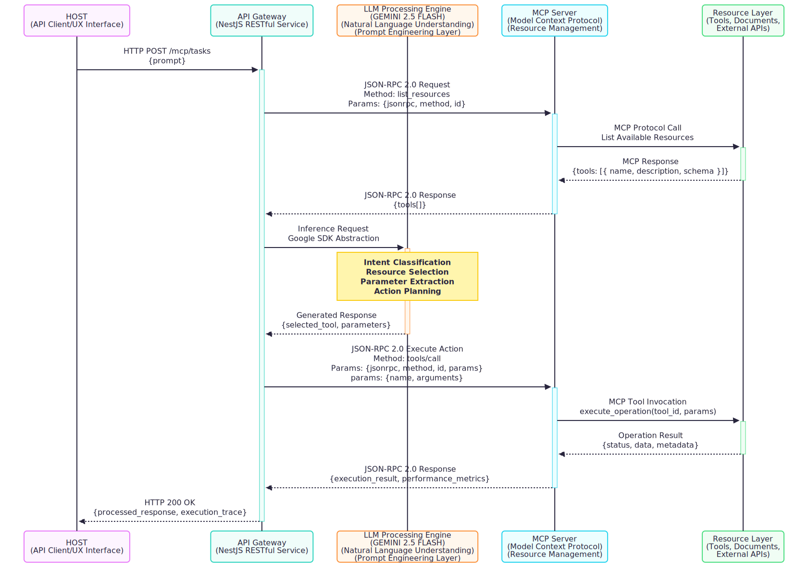
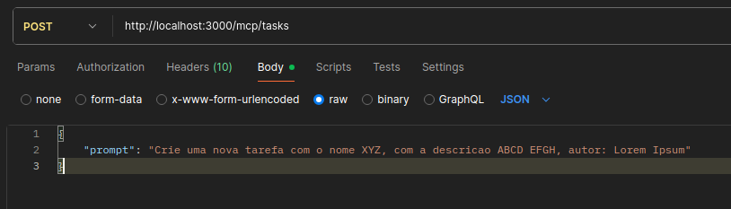
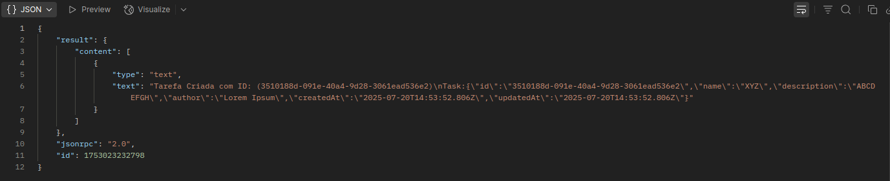

# Sistema LLM com Model Context Protocol

Sistema de processamento de linguagem natural que integra LLM (GEMINI 2.5 FLASH) com recursos externos via Model Context Protocol (MCP) para criação de Tarefas.

## Arquitetura


## Componentes

- **API REST**: Serviço HTTP em NestJS
- **LLM Engine**: GEMINI 2.5 FLASH para processamento de linguagem natural
- **MCP Server**: Gerenciamento de recursos via Model Context Protocol
- **Resource Layer**: Tools, documentos e APIs externas

## Demonstração
- **Request**:


- **Response**:



## Stack Técnico

- **Backend**: NestJS (TypeScript)
- **LLM**: Google GEMINI 2.5 FLASH
- **Protocol**: Model Context Protocol (MCP)
- **Comunicação**: JSON-RPC 2.0, REST API
- **Client**: API Client

## Acesso ao LLM (porta: 3000)
```bash
POST /mcp/tasks
Content-Type: application/json

{
  "query": "Sua consulta aqui",
}
```

## Configuração

Configure as variáveis de ambiente:

```env
GEMINI_API_KEY=your_api_key
```